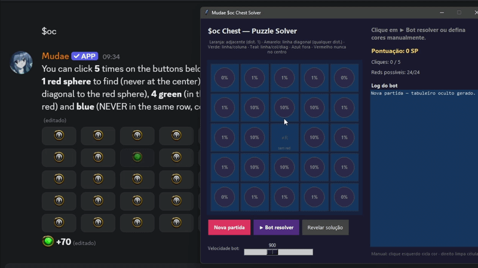

# 🎯 Muda Remote Solver

An intelligent solver and assistant for the **Muda Remote** puzzle minigame.

The application allows players to solve puzzles manually with probability assistance or automatically using an optimized bot that maximizes the expected score.

---

## Features

- 🧠 Intelligent puzzle solver
- 🤖 Automatic Bot Solver
- 🎮 Manual solving mode
- 📊 Real-time probability calculations
- 🔴 Remaining possible Red positions
- 💰 Expected score calculation
- ⚡ Optimized board filtering with caching
- 🖥️ Simple Tkinter graphical interface

---

## Requirements

- Python 3.10 or newer
- Windows 10/11 (recommended)

---

## How to Use



---

## Windows SmartScreen Notice

This application is **not digitally code signed**. As a result, Windows SmartScreen may display a warning the first time you run the executable.

This **does not necessarily mean the application is malicious**. It simply means that the executable has not been signed with a trusted code-signing certificate.

If you downloaded the application from the official GitHub repository and trust the source, you can continue by clicking:

1. **More info**
2. **Run anyway**

If you prefer, you can also review the source code and build the executable yourself.


---
## Installation

### 1. Clone the repository

```bash
git clone https://github.com/yourusername/muda-remote-solver.git
cd muda-remote-solver
```

or simply download the ZIP and extract it.

---


### 1. Install dependencies

This project only uses Python's standard library.

No external packages are required.

---

## Installing the Font

The interface uses a custom font.

1. Open the **font** folder.
2. Double-click the `.ttf` file.
3. Click **Install**.

Or:

- Right-click the font.
- Select **Install for all users**.

Restart the application after installing the font.

---

## Running

Execute:

```bash
oc_solver_visual.py.py
```

or

```bash
python -m oc_solver_visual
```

depending on your project structure.

---

# How to Use

## Manual Mode

1. Start the application.
2. Start the Mudae $oc (ourochest puzzle)
3. Click a tile.
4. Select the color revealed in-game.
5. Repeat for every click.
6. The solver automatically updates:
   - Remaining possible boards
   - Remaining Red positions
   - Best recommended move

---

## Bot Mode

Click

```
▶ Bot Solver
```

The bot will automatically (it's only an simulation, for really complete $oc in discord u need do it yourself):

- choose the best move;
- maximize the expected score;
- stop after finding the Red tile or using all available clicks.

---

# Interface

| Label | Description |
|--------|-------------|
| Score | Current puzzle score |
| Clicks | Number of clicks used |
| Possible Reds | Remaining valid Red locations |
| Status | Solver recommendation or game state |

---

# Project Structure

```
project/
├── oc_solver/
│   ├── oc_solver_core.py
│   ├── oc_solver_visual.py
│
└── README.md
```

---

# Algorithm

The solver works by:

1. Generating every valid board configuration.
2. Removing impossible boards after every observation.
3. Computing probabilities for every remaining tile.
4. Estimating expected score.
5. Choosing the move with the highest expected value.

Recent optimizations include:

- cached board filtering;
- reduced redundant calculations;
- significantly faster manual interaction.

---

# Troubleshooting

## ModuleNotFoundError

Run the project from its root folder.

---

## Font is not displayed

Install the font manually and restart the application.

---

# License

This project is provided for educational and personal use.
